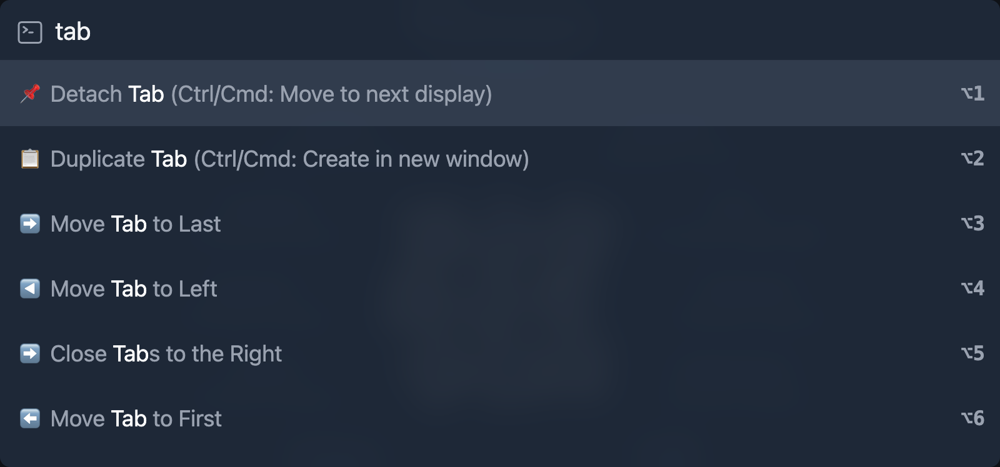

<h1 align="center">
 
Hacklets Browser Extension
</h1>

  A command palette for your browser. Search bookmarks, run commands, and execute scripts with a Spotlight / VS Code-style palette.

  

## Issues

Found a bug or have an idea? Open an issue on the [issue tracker](https://github.com/ricobl/hacklets/issues).
